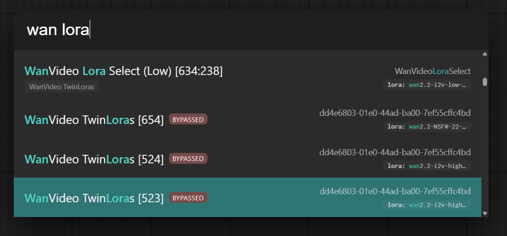

# Ovum Spotlight

Behold: a lantern built for wayfinding through the labyrinth of your workflows. Ovum Spotlight is a focused, front-end
and server-side extension for ComfyUI that lets you call attention to what matters, cut the rest to ribbons, and
interrogate your data with the cool precision of a knife laid flat on glass. It is swift to enable, exacting in
temperament, and deeply extensible.




## tl;dr

The (configurable) hotkeys are `Control`+`K` or if you are lazy, `/`. Hold down `Shift` while scrolling to have the
graph scroll with you to the highlighted node, that includes going inside subgraphs!

## What it does

- Highlights and surfaces values from running nodes and responses in ways designed for immediate, decisive action.
- Adds tiny-but-piercing UI elements for quick inspection, status, and search.
- Provides a backend route you can query for Spotlight data to integrate in panels, overlays, or your own bespoke rituals.

The point is not a floodlight. The point is a clean, interrogative beam.

## Install

Choose one. Do not dither.

- ComfyUI Manager: search for `ovum-spotlight` and install.
- Manual: clone https://github.com/sfinktah/ovum-spotlight into your ComfyUI `custom_nodes` folder.

## Extensible by design

Spotlight is a spine with sockets. You are encouraged to add your own lenses—“keywords” and handlers—to extract or present information in the way you prefer. The repository includes examples to imitate with minimal bloodletting.

- Add frontend keyword parsers to augment how text or values are marked and revealed.
- Add backend handlers to compute or enrich Spotlight payloads.
- Ship self-contained examples so others can follow your tracks.

You are not trapped in our preferences. Hook your own.

## Writing a keyword extension (example: “age”)

Suppose you want Spotlight to read a plain number and whisper how old it is in human time. The “age” keyword does exactly that: it takes an epoch or ISO timestamp and renders something concise, e.g., “37s ago.”

Below are minimal patterns you can adapt. They are examples; fit them to your own glass case and lock.

### 1) Frontend hook (JavaScript)

- Register a small keyword recognizer with Spotlight’s client.
- Parse values from node status or response.
- Render an inline badge with a tooltip.
``` javascript
// Register default handler to:
// 1) add a help command item
// 2) contribute node items whose combobox widgets' current value matches the query
// Note: Spotlight core will run FZF using each item's searchText; since default handlers
// are not given the query directly, we include combobox values in searchText so they can match.
window.OvumSpotlight?.registerDefaultHandler((ctx) => {
    const items = [];

    // Help/command item
    items.push({
        "@type": "command",
        id: "sample-help",
        title: "Sample Spotlight Provider: type 'sample <text>'",
        itemClass: "demo",
        searchText: "sample spotlight help",
        onSelect: () => {
            app.extensionManager.toast.add({
                severity: 'info',
                summary: "Sample Spotlight Provider: type 'sample <text>'",
                life: 5000,
            });
        }
    });
```

### 2) Backend route (Python, optional)

If you want server help—for relaying APIs, or doing devilishly clever things, there are examples in `spotlight_routes.py`
```py
@PromptServer.instance.routes.get(f"{SPOTLIGHT_API_BASE}/age")
async def spotlight_age(request: web.Request):
    """Proxy to agify.io to predict age from a given name.
    Returns JSON: { name, age, count }.
    """
    name = request.query.get('name') or ''
    if not name:
        return web.json_response({"error": True, "message": "missing name"}, status=400)
    try:
        timeout = ClientTimeout(total=30)
        url = f"https://api.agify.io/?name={quote_plus(name)}"
        async with ClientSession(timeout=timeout) as sess:
            async with sess.get(url) as resp:
                data = await resp.json()
        # Normalize response
        age = data.get('age') if isinstance(data, dict) else None
        count = data.get('count') if isinstance(data, dict) else None
        return web.json_response({"name": name, "age": age, "count": count})
    except Exception as e:
        logger.info(f"[ovum] spotlight age fetch failed: {e}")
        return web.json_response(
            {"name": name, "age": None, "count": None, "error": True, "message": "fetch failed"}, status=502)
```

## Other examples included

- Sample node demonstrating how Spotlight-aware outputs can publish status succinctly.
- Patterns for adding compact UI affordances that do not shout but are impossible to miss.
- Keyword samples you can copy, rename, and repurpose.

## Compatibility

- Plays with ComfyUI without demanding fealty.

## Contributing

- Keep additions minimal, surgical, and documented.
- Provide one example for every new keyword or UI trick.
- Favor small PRs that do one thing well.

## License

By the sacred bones of MIT, this code is hereby released into the void of Open Source, anno 2025:

You who would wield this software, know your rights eternal:

- To use and modify without restraint
- To distribute copies with impunity
- To transmute it into commercial endeavors

Provided always that the original copyright notice and this permission notice shall remain, carved in stone, within all
copies or substantial portions of the Software.

THE SOFTWARE IS PROVIDED "AS IS", WITHOUT WARRANTY OF ANY KIND, EXPRESS OR IMPLIED, INCLUDING BUT NOT LIMITED TO THE
WARRANTIES OF MERCHANTABILITY, FITNESS FOR A PARTICULAR PURPOSE AND NONINFRINGEMENT. IN NO EVENT SHALL THE AUTHORS OR
COPYRIGHT HOLDERS BE LIABLE FOR ANY CLAIM, DAMAGES OR OTHER LIABILITY, WHETHER IN AN ACTION OF CONTRACT, TORT OR
OTHERWISE, ARISING FROM, OUT OF OR IN CONNECTION WITH THE SOFTWARE OR THE USE OR OTHER DEALINGS IN THE SOFTWARE.

So witness the Ninth House, keepers of the tomb of MIT.

## Conclusion

Go on then. Turn the light. See what the graph has been hiding from you, and make it answer.
